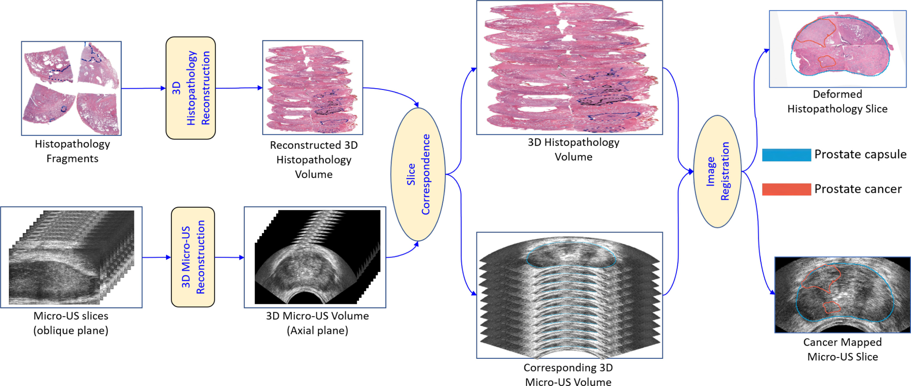

<div align=center> <h1>
  
  Image Registration of <i>In Vivo</i> Micro-Ultrasound and <i>Ex Vivo</i> Pseudo-Whole Mount Histopathology Images of the Prostate: A Proof-of-Concept Study</h1>

Welcome to the repository containing the code for our **Microu-Us and Histopathology Image Registration Network**, a deep-learning model designed for registering micro-ultrasound and histopathology images.
  
[](https://www.linkedin.com/in/imrannust/) &emsp;
[](https://www.researchgate.net/profile/Brianna_Nguyen2) &emsp;
[](https://www.researchgate.net/profile/Brianna_Nguyen2) &emsp;
[](https://www.linkedin.com/in/sara-falzarano-3a788941/) &emsp;
[](https://www.uclahealth.org/providers/anthony-sisk) &emsp;
[](https://www.linkedin.com/in/muxuan-liang-5b98aa47/) &emsp;
[](https://urology.ufl.edu/about-us-2/faculty-staff-directory-3/john-michael-dibianco-md/) &emsp;
[](https://urology.ufl.edu/about-us-2/meet-our-team/li-ming-su-md/) &emsp;
[](https://yuyinzhou.github.io/) &emsp;
[](https://urology.ufl.edu/about-us-2/faculty-staff-directory-3/jason-p-joseph-md/) &emsp;
[](https://www.uclahealth.org/providers/wayne-brisbane) &emsp;
[](https://www.linkedin.com/in/wei-shao-438782115/)

</div>

## Repository Contents


1. [Overview](#overview)
2. [Directory Structure](#directory-structure)
3. [Dataset Detail](#dataset-detail)
4. [Scripted Code](#scripted_code)
5. [Interactive Code](#interactive_code)
6. [Dependencies](#dependencies)
7. [Citations](#citations)

---

<h2>Overview <a id="overview" ></a></h2>

This repository contains code and a dataset for a semi-automated approach to registering **in vivo micro-ultrasound (Micro-US)** images with **ex vivo whole-mount histopathology** images for prostate cancer diagnosis.

Our method utilizes deep learning to improve the accuracy of interpreting Micro-US images, a cost-effective alternative to MRI-guided biopsies. The challenge lies in differentiating cancerous from healthy tissue due to subtle variations in grayscale.

<div align=center> 
  
</div>

**Key Features:**

- **Code for image registration:** This code implements a two-stage deep learning framework for registering Micro-US slices with histopathology images.
- **Publicly available dataset:** The dataset for eighteen subjects can be downloaded from the link, containing a dataset of 3D Micro-US and 3D histopathology volumes.
- **High accuracy:** Our evaluation demonstrates a Dice coefficient of 0.97 and a mean landmark error of 2.84 mm, indicating successful image alignment.

This is a proof-of-concept study showcasing the potential of deep learning for more accurate Micro-US prostate cancer diagnosis.

---

<h2>Directory Structure<a id=directory-structure"></a></h2>


<h3> 1. Clone the Repository:</h3>

  Open your terminal or command prompt and clone the project directory as follows:
  ```
  git clone https://github.com/mirthAI/MUS-Pathology-Registration.git
  ```

<h3> 2. Navigate to the Directory: </h3>

  Once the repository is cloned, navigate to the desired directory using the `cd` command as follows:
  ```
  cd MUS-Pathology-Registration
  ```
<h3> 3. Directory Structure </h3>


```
MUS-Pathology-Registration/
├── data/                                                  # Main data directory in NIfTI format
│   ├── nifti_data/
|   |     ├── Subject002/
│   |     │       ├── microUS_3D_Subject002_image.nii.gz             # 3D Micro-US Volume
│   │     │       ├── microUS_3D_Subject002_tumor_label.nii.gz       # 3D Micro-US Tumor Label
│   │     │       ├── Subject002_histopathology_cancer.seg.nrrd      # 3D Histopathology Cancer Labels
│   │     │       ├── Subject002_histopathology_landmark.seg.nrrd    # 3D Histopathology Landmarks
│   │     │       ├── Subject002_histopathology_volume.nii.gz        # 3D Histopathology Volume
│   │     │       ├── Subject002_microUS_landmark.seg.nrrd           # 3D Micro-US Landmarks
│   │     │       └── Subject002_slice_correspondence.seg.nrrd       # 3D Micro-US Prostate Labels for Corresponding Histopathological Slices
│   |     ├── Subject006/
│   │     │       ├── microUS_3D_Subject006_image.nii.gz             # 3D Micro-US Volume
│   │     │       ├── microUS_3D_Subject006_tumor_label.nii.gz       # 3D Micro-US Tumor Label
│   │     │       ├── Subject006_histopathology_cancer.seg.nrrd      # 3D Histopathology Cancer Labels
│   │     │       ├── Subject006_histopathology_landmark.seg.nrrd    # 3D Histopathology Landmarks
│   │     │       ├── Subject006_histopathology_prostate.seg.nrrd    # 3D Histopathology Prostate Label
│   │     │       ├── Subject006_histopathology_volume.nii.gz        # 3D Histopathology Volume
│   │     │       ├── Subject006_microUS_landmark.seg.nrrd           # 3D Micro-US Landmarks
│   │     │       └── Subject006_slice_correspondence.seg.nrrd       # 3D Micro-US Prostate Labels for Corresponding Histopathological Slices
│   |     ├── Subject008/
│   │     └──  ...                                                   # Similar structure for eighteen subjects
│   └── .................       
│
├── InteractiveCodes/                                                # Folder for interactive Jupyter notebooks
│   ├── 1_Preparing_the_Data.ipynb                                   # Notebook to prepare the dataset for image registration
│   ├── 2_Train_Registration_Networks.ipynb                          # Notebook for training deep-learning networks for registration
│   ├── 3_Performance_Evaluation.ipynb                               # Notebook to evaluate and produce registered images and metrics
│   └── utils/                                                       # Utility functions required for notebooks
│
└── ScriptedCodes/                                                   # Folder for scripted Jupyter notebooks
    ├── data_preparation.py                                          # Python script to prepare the dataset for image registration
    ├── run_data_preparation.sh                                      # Bash script to run the data_preparation.py file
    ├── train_image_registration_network.py                          # Python script for training deep-learning networks for registration
    ├── run_train_image_registration_network.sh                      # Bash script to run train_image_registration_network.py file
    ├── prediction_and_evaluation.py                                 # Python script to evaluate and produce registered images and metrics
    ├── run_prediction_and_evaluation.sh                             # Bash script to run the prediction_and_evaluation.py file
    └── utils/                                                       # Utility functions required for scripts' execution

```

**Instructions for downloading the dataset:**

Please download the dataset from the provided link and place it in the data directory. Ensure your final data directory matches the structure defined above.

----


<div align=center> <h1> 
  <a id="scripted_code"></a>
  Scripted Code
</h1></div>

For those who prefer running scripts from the shell, follow these steps to train the model:


1. **Create an Environment:** Create a new virtual environment using `conda`.
   ```bash
   conda create --name MicroUS_Hist_Registration python=3.10
   ```
2. **Activate the Environment:** Activate the newly created environment.
   ```bash
   conda activate MicroUS_Hist_Registration
   ```
3. **Install Required Packages:** Install the necessary packages listed in the **[requirements.txt](https://github.com/mirthAI/MUS-Pathology-Registration/blob/main/requirements.txt)** file.
   ```bash
   pip install -r ./requirements.txt
   ```
   If you cannot install from the `requirements.txt` file, you can manually install the [dependencies](#dependencies) listed below.
4. **Prepare the Dataset:** Prepare the dataset for training a deep-learning-based image registration network.
   - Navigate to the directory where the script is saved:
     ```bash
     cd ScriptedCodes
     ```
     
    - Now run the following commands to prepare the dataset for the image registration task:
    
      ```bash
      chmod +x ./run_data_preparation.sh
      ./run_data_preparation.sh   
      ```
      
   This will create two folders, `png_data` and `processed_png_data`, inside the `data` directory. The images inside `processed_png_data` will be used to train the networks; you may delete the `png_images` directory if desired.

6. **Train the Image Registration Network:**
   - Confirm that your current working directory is `ScriptedCodes`.
   - To initiate the training process for both the affine and deformable registration networks across six folds, execute the following commands:
        ```bash
        chmod +x ./run_training.sh
        ./run_training.sh
        ```
   - The script will automatically create a `saved_model` folder within the `ScriptedCodes` directory.
   - The training process will proceed, and the model achieving the lowest loss will be stored in the `saved_model` directory.
   
7. **Prediction and Evaluation:**
   - Verify that you are located within the `ScriptedCodes` directory.
   - Execute the following commands to commence the prediction and evaluation process:

     ```bash
     chmod +x ./run_prediction_and_evaluation.sh
     ./run_prediction_and_evaluation.sh
     ```
   - Upon successful execution, the results directory will be populated with the deformed registered images.
   - Concurrently, a comprehensive CSV file detailing the evaluation metrics will be generated. This file includes the **Dice coefficient**, **Hausdorff distance**, **Urethra distance**, and distances for **Landmark 1**, **Landmark 2**, and **Landmark 3**, along with the **average landmark distance**.

---


<div align="center">
  <a id="interactive_code"></a>
  <h1>Interactive Code</h1>
</div>

For those who prefer Jupyter notebooks, navigate to the `InteractiveCodes` directory, where you will find three notebooks:

1. **[1_Preparing_the_Data.ipynb](https://github.com/mirthAI/MUS-Pathology-Registration/blob/main/InteractiveCodes/1_Preparing_the_Data.ipynb)**
2. **[2_Train_Registration_Networks.ipynb](https://github.com/mirthAI/MUS-Pathology-Registration/blob/main/InteractiveCodes/2_Train_Registration_Networks.ipynb)**
3. **[3_Performance_Evaluation.ipynb](https://github.com/mirthAI/MUS-Pathology-Registration/blob/main/InteractiveCodes/3_Performance_Evaluation.ipynb)**

### Steps:

1. **Prepare the Dataset:** 
   - Open `1_Preparing_the_Data.ipynb` and run it. This self-explanatory notebook will guide you through all the dataset preparation steps. 
   - This process will create two folders, `png_data` and `processed_png_data`, inside the `data` directory. The images inside `processed_png_data` will be used to train the networks; you may delete the `png_images` directory if desired.

2. **Train Image Registration Network:** 
   - Open `2_Train_Registration_Networks.ipynb` and run it. This notebook will walk you through the process of training both affine and deformable registration networks.

3. **Prediction and Evaluation:** 
   - Open `3_Performance_Evaluation.ipynb` and run it. This notebook will guide you through the steps for prediction and generating evaluation metrics.
   - This process will generate the deformed registered images in the `results` directory. Additionally, a CSV file will be generated containing the Dice coefficient, Hausdorff distance, Urethra distance, distances for Landmarks 1, 2, and 3, as well as the average landmark distance.

Feel free to experiment and improve upon our results.

---

## Dependencies <a id="dependencies"></a>

<div align=center>
  
  &emsp;
  &emsp;
 &emsp;
 &emsp;
 &emsp;
 &emsp;
 &emsp;
 &emsp;
 &emsp;
 &emsp;
  &emsp;
  &emsp;


</div>

---

## Citations <a id="citations"></a>

If you utilize our code or dataset in your research, we kindly ask you to acknowledge our **[work](https://www.sciencedirect.com/science/article/pii/S1746809424007158?via%3Dihub)** by citing the following **[publication](https://www.sciencedirect.com/science/article/pii/S1746809424007158?via%3Dihub)**:

<a href="https://www.sciencedirect.com/science/article/pii/S1746809424007158?via%3Dihub"></a>
```bibtex
@article{IMRAN2024106657,
title = {Image registration of in vivo micro-ultrasound and ex vivo pseudo-whole mount histopathology images of the prostate: A proof-of-concept study},
journal = {Biomedical Signal Processing and Control},
volume = {96},
pages = {106657},
year = {2024},
issn = {1746-8094},
doi = {https://doi.org/10.1016/j.bspc.2024.106657},
url = {https://www.sciencedirect.com/science/article/pii/S1746809424007158},
author = {Muhammad Imran and Brianna Nguyen and Jake Pensa and Sara M. Falzarano and Anthony E. Sisk and Muxuan Liang and John Michael DiBianco and Li-Ming Su and Yuyin Zhou and Jason P. Joseph and Wayne G. Brisbane and Wei Shao},
}
```
